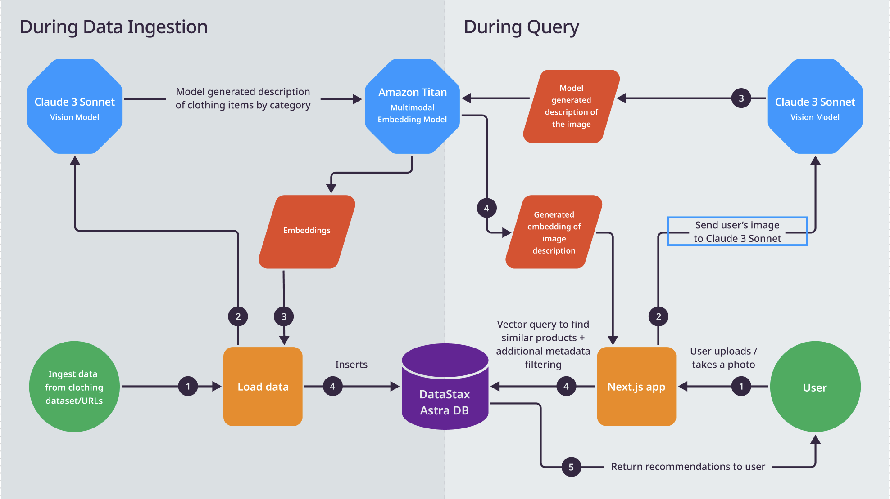

# Fashion Buddy

Fashion Buddy is a multimodal RAG application powered by DataStax Astra DB which performs a similarity search on the clothing described by AI in a user's uploaded image.

What should happen from the user's perspective is that:

1. User uploads a photo
2. Photo gets put through the Claude 3 Sonnet model to generate an enhanced description
3. The enhanced descrption plus the image itself get sent through Amazon Titan for an embedding
4. The embedding gets sent to the Astra DB vector database for similarity search
5. The most relevant results get sent back to the user



## Getting Started

### Prerequisites

- An [Astra DB account](https://astra.datastax.com/register)
  - An Astra Vector Database
  - An Astra DB Application Token
  - An Astra DB API Endpoint
  - An Astra DB Collection with ingested data
- An Anthropic account and [API key](https://console.anthropic.com/dashboard)
- AWS account
  - Request large language model access to:
    - Amazon Titan Multimodal Embeddings G1
    - Anthropic Claude 3 Sonnet
  - Region
- AWS IAM user with `AmazonBedrockFullAccess` permissions
  - AWS Access Key ID
  - AWS Secret Access Key

NOTE: The data ingestion portion of this application is not currently set up for Bedrock and Anthropic and is assumed to have been set up in Astra DB prior to running this application.

### Setup

1. Clone this repository to your local machine.
2. Install the dependencies by running `npm install` in your terminal.
3. Set up the following environment variables in your IDE or `.env` file:
   - `ANTHROPIC_API_KEY`: api key from Anthropic
   - `ASTRA_DB_ENDPOINT`: Your Astra DB vector database endpoint
     - Copy from the `Database Detail`
   - `ASTRA_DB_APPLICATION_TOKEN`: The generated app token for your Astra database
     - To create a new token go to your database's `Connect` tab and click `Generate Token`. (your Application Token begins with `AstraCS:...`)
   - `ASTRA_COLLECTION`: The name of the Astra DB collection to use for the similarity search
   - `_AWS_ACCESS_KEY_ID`: AWS Access Key ID
   - `_AWS_SECRET_ACCESS_KEY`: AWS Secret Access Key
   - `_AWS_REGION`: AWS Region

### Load your DB

This app uses a sample dataset of Zara clothing from [Kaggle](https://www.kaggle.com/datasets/abhinavtyagi2708/zara-dataset-men-and-women-clothing?resource=download)

Run `npm run load` to load the dataset. This can take a long time so run it as long as you see fit (there will be failures mainly due to items that are no longer active).
This step calls Gemini with each product image and gets an item description to embed and add to your collection.

### Run the application

Install the dependencies:

```bash
npm install
# or
yarn install
# or
pnpm install
```

Then run the development server:

```bash
npm run dev
# or
yarn dev
# or
pnpm dev
# or
bun dev
```

Open [http://localhost:3000](http://localhost:3000) with your browser to see the result.

## Learn More

To learn more about Next.js, take a look at the following resources:

- [Next.js Documentation](https://nextjs.org/docs) - learn about Next.js features and API.
- [Learn Next.js](https://nextjs.org/learn) - an interactive Next.js tutorial.

You can check out [the Next.js GitHub repository](https://github.com/vercel/next.js/) - your feedback and contributions are welcome!

## Deploy on Vercel

You can easily deploy your chatbot to Vercel by clicking the button below:

[](https://vercel.com/new/clone?repository-url=https://github.com/riptano/fashion-buddy&env=ASTRA_DB_API_ENDPOINT,ASTRA_DB_APPLICATION_TOKEN,GOOGLE_API_KEY)

Remember to set your environment variables to the values obtained when setting up your Astra DB and Google accounts.
